# Part 1 — Redis Setup & Replication

## Overview

This document covers the setup of Redis OSS on **Server A** and Redis Enterprise on **Server B**, including data loading with `memtier-benchmark` and configuring replication from OSS → Redis Enterprise.

| | Server A | Server B |
|-|----------|----------|
| **Role** | Redis OSS (Source) | Redis Enterprise (Target) |
| **IP** | TBD | TBD |

---

## 1. Redis OSS Installation (Server A)

### Version
- Redis OSS **7.2.0**

### Step 1 — Add Redis APT Repository

Reference: https://redis.io/docs/latest/operate/oss_and_stack/install/install-stack/apt/

```bash
# Install prerequisites
sudo apt-get install lsb-release curl gpg

# Add Redis GPG key
curl -fsSL https://packages.redis.io/gpg | sudo gpg --dearmor -o /usr/share/keyrings/redis-archive-keyring.gpg
sudo chmod 644 /usr/share/keyrings/redis-archive-keyring.gpg

# Add Redis APT repository
echo "deb [signed-by=/usr/share/keyrings/redis-archive-keyring.gpg] https://packages.redis.io/deb $(lsb_release -cs) main" | sudo tee /etc/apt/sources.list.d/redis.list

# Update package list
sudo apt-get update

# Check available Redis versions
apt policy redis
```

> ✅ APT repository setup completed. Ran `apt policy redis` to list available versions.

### Step 2 — Install Redis OSS 7.2.0

> ⚠️ **Important:** The APT version string requires an **epoch prefix `6:`** — see Troubleshooting Issue 1 below for details.

```bash
# Correct install command (with epoch prefix)
sudo apt-get install -y \
  redis=6:7.2.0-1rl1~focal1 \
  redis-server=6:7.2.0-1rl1~focal1 \
  redis-sentinel=6:7.2.0-1rl1~focal1 \
  redis-tools=6:7.2.0-1rl1~focal1

# Verify installation
redis-server --version
```

### Step 3 — Install Status

| Step | Status |
|------|--------|
| Add Redis APT repo & GPG key | ✅ Done |
| Run `apt policy redis` to check versions | ✅ Done |
| Install Redis OSS 7.2.0 | ✅ Done |
| Verify installation (`redis-server --version`) | ✅ Done |

### Key Configuration — `redis.conf`

**Config file path on Server A:** `/etc/redis/redis.conf`

#### Step 1 — Locate and backup the config file

```bash
# Find redis.conf
sudo find / -name "redis.conf" 2>/dev/null
# Output: /etc/redis/redis.conf

# Backup before making changes
sudo cp /etc/redis/redis.conf /etc/redis/redis.conf.bak
```

> ✅ Config file located at `/etc/redis/redis.conf`. Backup created at `/etc/redis/redis.conf.bak`.

#### Step 2 — Edit redis.conf

```bash
sudo nano /etc/redis/redis.conf
```

Changes made:

```conf
# Changed default port from 6379 to 6380
port 6380

# Persistence — AOF with always fsync for best durability
appendonly yes
appendfsync always

# (Optional) RDB snapshot as additional safety net
save 900 1
save 300 10
save 60 10000
```

> ✅ Port changed to **6380**. AOF persistence enabled with `appendfsync always`.

#### Step 3 — Restart Redis and verify

```bash
# Restart Redis service
sudo systemctl restart redis-server

# Verify Redis is running on port 6380
redis-cli -p 6380 PING
# Output: PONG ✅

# Confirm port from config
redis-cli -p 6380 CONFIG GET port
```

> ✅ Redis restarted successfully. Confirmed running on port **6380** via `redis-cli PING`.

### Configuration Snapshots

<!-- Add screenshot of redis.conf showing port 6380 + AOF settings here -->
<!-- Example:  -->

<!-- Add screenshot of redis-cli PING confirming port 6380 here -->
<!-- Example: 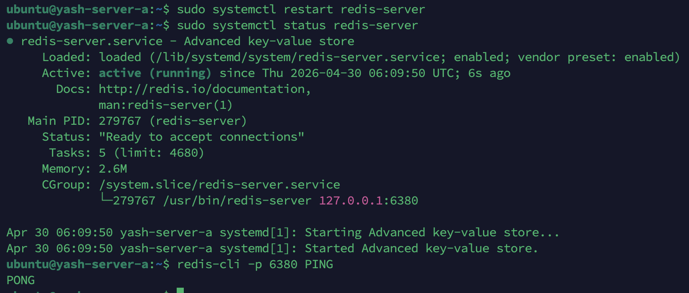 -->

---

## 2. Data Loading — memtier-benchmark

### Install memtier-benchmark

```bash
sudo apt-get install -y memtier-benchmark
```

> ✅ memtier-benchmark installed.

---

### Step 1 — Baseline Benchmark (Before Loading 100K Keys)

> **Purpose:** Establish baseline performance of the underlying hardware/network *before* loading data, so we can measure the impact of 100K keys on throughput and latency.

```bash
memtier_benchmark \
  -s 127.0.0.1 \
  -p 6380 \
  --protocol=redis \
  --test-time=60 \
  --ratio=1:1 \
  --data-size=100 \
  --clients=50 \
  --threads=4 \
  --key-pattern=R:R
```

**Baseline Results (Empty DB):**

| Type | Ops/sec | Hits/sec | Misses/sec | Avg Latency (ms) | P50 Latency (ms) | P99 Latency (ms) | P99.9 Latency (ms) | KB/sec |
|------|---------|----------|------------|-----------------|-----------------|-----------------|-------------------|--------|
| Sets | 10,019.30 | — | — | 9.81735 | 9.53500 | 17.79100 | 24.95900 | 1,447.06 |
| Gets | 10,017.65 | 6.56 | 10,011.09 | 9.80623 | 9.53500 | 17.66300 | 25.08700 | 390.82 |
| **Totals** | **20,036.95** | **6.56** | **10,011.09** | **9.81179** | **9.53500** | **17.79100** | **24.95900** | **1,837.88** |

> ✅ Baseline captured. Total throughput: **~20,037 ops/sec** | Avg latency: **9.81 ms** | P99: **17.79 ms**

<!-- Add baseline benchmark screenshot here -->
<!-- Example: 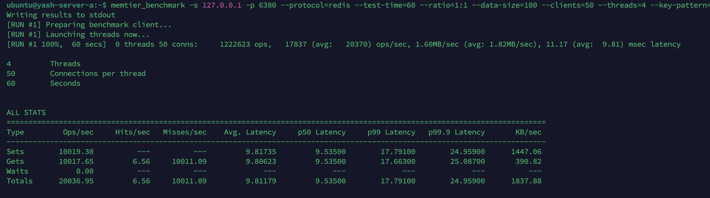 -->

---

### Step 2 — Load ≥ 100,000 Keys

```bash
memtier_benchmark -s 127.0.0.1 -p 6380 --protocol=redis -n 100000 --ratio=1:0 --key-pattern=S:S --data-size=100
```

> **Note:**
> - `-n 100000` — 100,000 requests per client (default: 4 threads × 50 clients)
> - `--ratio=1:0` — writes only (no reads)
> - `--key-pattern=S:S` — sequential key generation (source and destination both sequential), produces unique keys
> - `--data-size=100` — 100-byte value per key

```bash
# Verify key count after loading
redis-cli -p 6380 DBSIZE
# Expected: ≥ 100,000
```

**Data Load Results:**

| Metric | Value |
|--------|-------|
| Total Keys Loaded | 100,000 |
| Threads | 4 |
| Connections per Thread | 50 |
| Requests per Client | 100,000 |
| Throughput (ops/sec) | 15,596.59 |
| Avg Latency (ms) | 12.84 |
| P50 Latency (ms) | 9.60 |
| P99 Latency (ms) | 100.86 |
| P99.9 Latency (ms) | 146.43 |
| KB/sec | 2,222.04 |

```
ALL STATS
Type         Ops/sec     Hits/sec   Misses/sec    Avg. Latency     p50 Latency     p99 Latency   p99.9 Latency       KB/sec 
----------------------------------------------------------------------------------------------------------------------------
Sets        15596.59          ---          ---        12.84043         9.59900       100.86300       146.43100      2222.04 
Gets            0.00         0.00         0.00             ---             ---             ---             ---         0.00 
Waits           0.00          ---          ---             ---             ---             ---             ---          --- 
Totals      15596.59         0.00         0.00        12.84043         9.59900       100.86300       146.43100      2222.04 
```

> ✅ 100,000 keys loaded successfully. Throughput: **15,596.59 ops/sec** | Avg latency: **12.84 ms** | P99: **100.86 ms**

<!-- Add data load benchmark screenshot here -->
<!-- Example: 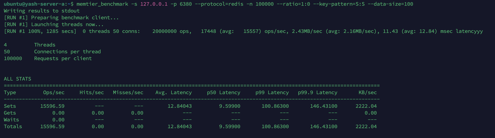 -->

---

### Step 3 — Post-Load Benchmark (After 100K Keys)

> **Purpose:** Compare performance against the baseline to observe the impact of 100K keys.

```bash
memtier_benchmark \
  -s 127.0.0.1 \
  -p 6380 \
  --protocol=redis \
  --test-time=60 \
  --ratio=1:1 \
  --data-size=100 \
  --clients=50 \
  --threads=4 \
  --key-pattern=R:R
```

**Post-Load Results (100K Keys DB):**

```
ALL STATS
Type         Ops/sec     Hits/sec   Misses/sec    Avg. Latency     p50 Latency     p99 Latency   p99.9 Latency       KB/sec 
----------------------------------------------------------------------------------------------------------------------------
Sets        11079.03          ---          ---         9.02786         8.76700        17.53500        25.72700      1600.12 
Gets        11077.25       129.99     10947.26         9.01673         8.76700        17.53500        25.47100       444.48 
Waits           0.00          ---          ---             ---             ---             ---             ---          --- 
Totals      22156.27       129.99     10947.26         9.02230         8.76700        17.53500        25.59900      2044.60 
```

**Baseline vs Post-Load Comparison:**

| Metric | Baseline (Empty DB) | Post-Load (100K Keys) | Delta |
|--------|--------------------|-----------------------|-------|
| Total Throughput (ops/sec) | 20,036.95 | 22,156.27 | ▲ +2,119.32 (+10.6%) |
| Throughput — Writes (ops/sec) | 10,019.30 | 11,079.03 | ▲ +1,059.73 (+10.6%) |
| Throughput — Reads (ops/sec) | 10,017.65 | 11,077.25 | ▲ +1,059.60 (+10.6%) |
| Avg Latency (ms) | 9.81 | 9.02 | ▼ -0.79 ms (-8.1%) |
| P50 Latency (ms) | 9.54 | 8.77 | ▼ -0.77 ms (-8.1%) |
| P99 Latency (ms) | 17.79 | 17.54 | ▼ -0.25 ms (-1.4%) |
| P99.9 Latency (ms) | 24.96 | 25.60 | ▲ +0.64 ms (+2.6%) |

> ✅ Post-load benchmark complete. With 100K keys, throughput **increased ~10.6%** and average latency **improved by ~8%** compared to baseline — consistent with Redis warming up its internal structures. P99.9 latency remained stable at ~25 ms.

<!-- Add post-load benchmark screenshot here -->
<!-- Example: 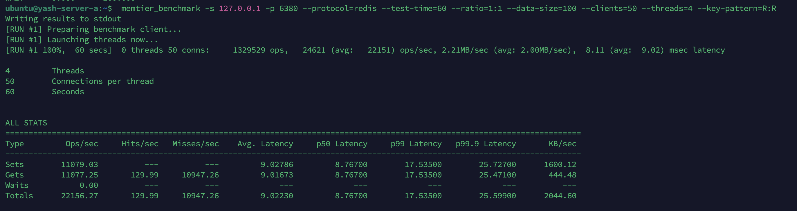 -->

---

## 3. Redis Enterprise Installation (Server B)

### Setup Details
- Version: Latest Redis Enterprise (downloaded from [redis.io](https://redis.io/docs/latest/operate/rs/installing-upgrading/install/install-on-linux/))
- Setup type: **No-DNS** (IP-based)
- Install method: Tar file via SFTP upload → `install.sh`

### Step 1 — Download & Upload Redis Enterprise Package

```bash
# On local machine — download latest Redis Enterprise tar from:
# https://redis.io/downloads/#software

# Upload to Server B via SFTP
sftp <user>@<SERVER_B_IP>
put <redislabs-tar-file-name>
exit
```

> ✅ Latest Redis Enterprise tar file downloaded and uploaded to Server B via SFTP.

### Step 2 — Extract and Install

Reference: https://redis.io/docs/latest/operate/rs/installing-upgrading/install/install-on-linux/

```bash
# Extract the tar file
tar vxf <redislabs-tar-file-name>

# Run the installer (non-interactive with -y flag)
sudo ./install.sh -y
```

> ✅ Redis Enterprise installed successfully via `install.sh -y`.

### Step 3 — Install Status

| Step | Status |
|------|--------|
| Download latest Redis Enterprise tar | ✅ Done |
| Upload to Server B via SFTP | ✅ Done |
| Extract tar file | ✅ Done |
| Run `sudo ./install.sh -y` | ✅ Done |

### Step 4 — Create Redis Enterprise Cluster & Database

> ⚠️ **No-DNS setup:** Use IP address directly — do not configure DNS hostnames.

#### Step 4a — Access the Web UI and Create Cluster

```bash
# Open browser on local machine:
https://<SERVER_B_IP>:8443
```

On the landing page, two options are presented:
- **Create Cluster** ← selected this option
- Join Cluster

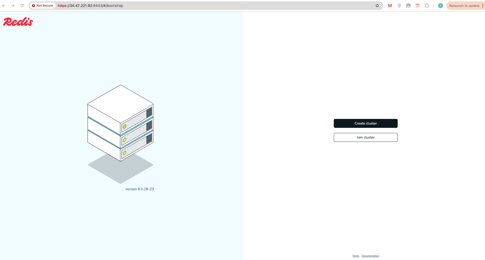

> ✅ Clicked **Create Cluster** to initialize a new single-node Redis Enterprise cluster.

#### Step 4b — Set Admin Credentials

The next screen prompts for cluster administrator credentials:

- **Email:** `<your-email>` (used as the admin login)
- **Password:** `<your-password>`

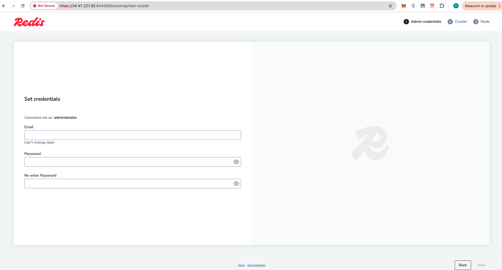

> ✅ Admin credentials set. These are used to log into the Redis Enterprise web UI going forward.

#### Step 4c — Configure the Cluster

Reference: https://redis.io/docs/latest/operate/rs/installing-upgrading/quickstarts/redis-enterprise-software-quickstart/

The cluster configuration screen presents several options. Only the **FQDN** was set:

| Field | Value |
|-------|-------|
| Cluster FQDN | `cluster.local` |
| Other fields | Left as defaults |

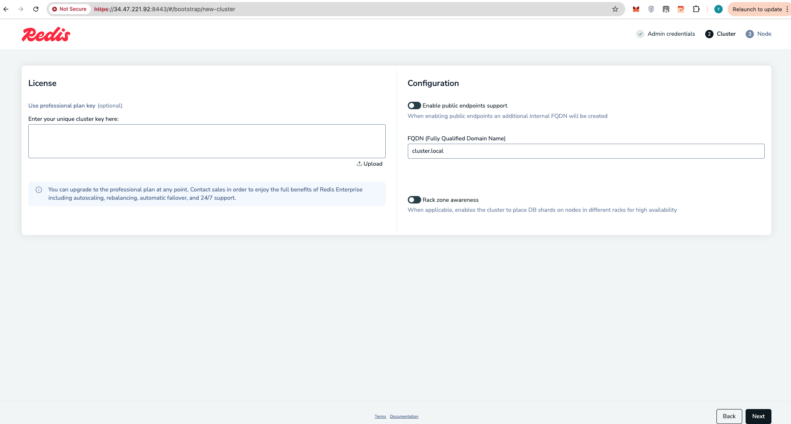

> ✅ Cluster FQDN set to `cluster.local`. Clicked **Next** to proceed.

> ⚠️ **No-DNS note:** Using `cluster.local` as the FQDN works for a single-node no-DNS setup. No external DNS configuration is required.

#### Step 4d — Default Configuration & Cluster Activation

A default configuration page was shown — all settings left as defaults. Clicked **Next** to proceed.

> The system then logged out automatically and redirected to the Redis Enterprise login screen.

#### Step 4e — Log In to Redis Enterprise Dashboard

Used the admin credentials created in Step 4b to log in:

```
URL:      https://<SERVER_B_IP>:8443
Email:    <your-email>
Password: <your-password>
```

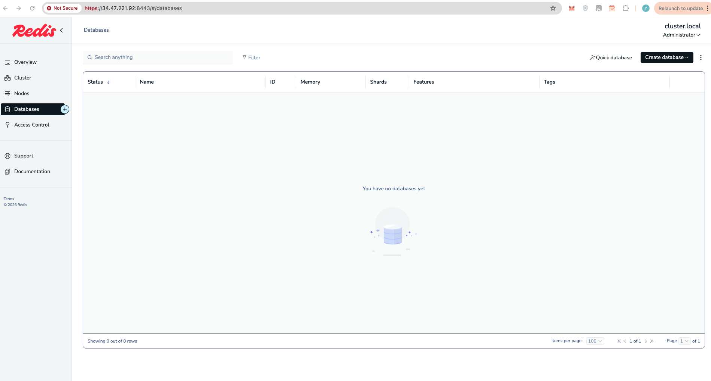

> ✅ Successfully logged into the Redis Enterprise cluster dashboard. Cluster is up and running.

#### Step 4f — Create Database

Reference: https://redis.io/docs/latest/operate/rs/databases/import-export/replica-of/create/#source-available-cluster

From the cluster dashboard, clicked **Create Database** and configured:

| Parameter | Value |
|-----------|-------|
| Region Type | Single Region |
| Database Name | `migration-target` |
| Memory Limit | 1 GB |
| Port | 12000 |
| Replica Of (Source) | `redis://<SERVER_A_IP>:6380` |

> ✅ Database `migration-target` created on port **12000** with **1 GB** memory limit and **Replica Of** configured to sync from Redis OSS on Server A (`redis://<SERVER_A_IP>:6380`).


---

## 4. Replication Configuration — Replica Of

### Setup
- **Source:** Redis OSS on Server A — `redis://<SERVER_A_IP>:6380`
- **Target:** Redis Enterprise DB `migration-target` on Server B — port `12000`
- **Direction:** OSS → Enterprise (Replica Of)

### Configuration Applied

Replica Of was configured directly during database creation in the Redis Enterprise web UI (Step 4f above).

**Source URL entered:**
```
redis://<SERVER_A_IP>:6380
```

Reference: https://redis.io/docs/latest/operate/rs/databases/import-export/replica-of/create/#source-available-cluster

> ✅ Replica Of configured. Redis Enterprise database `migration-target` (port 12000) is now replicating from Redis OSS on Server A (port 6380).

### Replication Status

> ✅ **Replica Of status: Synced** — Redis Enterprise web UI shows a green checkmark confirming the database is fully in sync with the source.

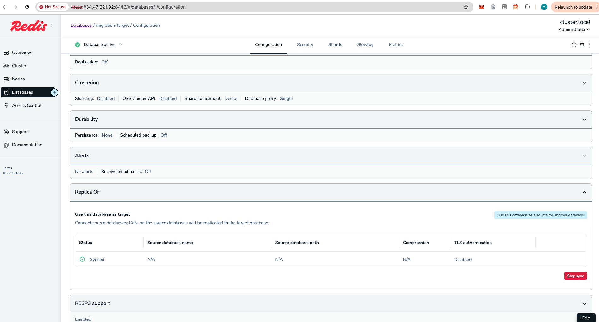

### Key Count Verification

```bash
# On Server A (OSS) — check key count
redis-cli -p 6380 DBSIZE

# On Server B (Redis Enterprise DB) — check key count
redis-cli -h <SERVER_B_IP> -p 12000 DBSIZE
```

```bash
# On Server A
redis-cli -p 6380 DBSIZE
# Output: 103316 ✅

# On Server B
redis-cli -p 12000 DBSIZE
# Output: 103316 ✅
```

| Server | Key Count |
|--------|-----------|
| Server A — Redis OSS (port 6380) | **103,316** |
| Server B — Redis Enterprise `migration-target` (port 12000) | **103,316** |
| Match? | ✅ Yes — keys match exactly |

<!-- Add DBSIZE screenshots here -->
<!-- Example:  -->
<!-- Example:  -->

> ✅ **Replication verified.** Both Redis OSS (Server A) and Redis Enterprise `migration-target` (Server B) have identical key counts of **103,316** — confirming successful Replica Of synchronization.

---

## 5. Troubleshooting Notes *(Optional)*

### Issue 1 — Redis 7.2.0 version not found via APT

**Command run:**
```bash
sudo apt-get install redis=7.2.0-1rl1~focal1 redis-server=7.2.0-1rl1~focal1 redis-sentinel=7.2.0-1rl1~focal1 redis-tools=7.2.0-1rl1~focal1
```

**Error:**
```
E: Version '7.2.0-1rl1~focal1' for 'redis' was not found
E: Version '7.2.0-1rl1~focal1' for 'redis-server' was not found
E: Version '7.2.0-1rl1~focal1' for 'redis-sentinel' was not found
E: Version '7.2.0-1rl1~focal1' for 'redis-tools' was not found
```

**Root Cause:**
The Redis APT repository at `packages.redis.io` only retains recent versions. Redis 7.2.0 may no longer be available in the APT package index, or the distro codename (`focal`) may not have that exact build string available.

**Resolution Steps:**

**Option 1 — Check exact available versions from the repo:**
```bash
# List all available redis-server versions
apt-cache madison redis-server

# Or use policy
apt-cache policy redis-server
```
Use the exact version string shown in the output (e.g., `7.2.x-1rl1~focal1`).

**Option 2 — Build Redis 7.2.0 from source (recommended if APT doesn't have it):**
```bash
# Install build dependencies
sudo apt-get install -y build-essential tcl

# Download Redis 7.2.0 source
wget https://download.redis.io/releases/redis-7.2.0.tar.gz
tar xzf redis-7.2.0.tar.gz
cd redis-7.2.0

# Build and install
make
make test       # optional but recommended
sudo make install

# Verify
redis-server --version
```

**Option 3 — Include the epoch prefix in the version string (✅ Correct Fix):**

Running `apt-cache madison redis-server` revealed the version string includes an **epoch prefix `6:`**:
```
redis-server | 6:7.2.0-1rl1~focal1 | https://packages.redis.io/deb focal/main amd64 Packages
```

The original command was missing the epoch `6:`. The correct install command is:
```bash
sudo apt-get install -y \
  redis=6:7.2.0-1rl1~focal1 \
  redis-server=6:7.2.0-1rl1~focal1 \
  redis-sentinel=6:7.2.0-1rl1~focal1 \
  redis-tools=6:7.2.0-1rl1~focal1

# Verify installation
redis-server --version
```

**Status:** ✅ Resolved — epoch prefix `6:` was missing from the version string

---

| Issue | Root Cause | Resolution | Status |
|-------|-----------|------------|--------|
| `Version '7.2.0-1rl1~focal1' not found` via APT | Epoch prefix `6:` missing from version string | Use full version `6:7.2.0-1rl1~focal1` with epoch prefix | ✅ Resolved |
| `Port 53 in use` / `Another DNS server already installed` during RE install | `systemd-resolved` occupying port 53 | Set `DNSStubListener=no`, recreate resolv.conf symlink, restart DNS — See Issue 2 | ✅ Resolved |
| `./install.sh: line 466: python: command not found` during RE install | Ubuntu 20.04+ ships `python3` only; `python` symlink missing | Install `python-is-python3` — See Issue 3 | ✅ Resolved |
| `Unable to connect to redis://<SERVER_A_IP>:6380` during Replica Of setup | UFW firewall on Server A blocking inbound TCP port 6380 | `sudo ufw allow 6380/tcp` on Server A — See Issue 4 | ✅ Resolved |

<!-- Add failure/resolution snapshots here if applicable -->
<!-- Example:  -->

---

### Issue 2 — Port 53 in Use During Redis Enterprise Installation

**Command run:**
```bash
sudo ./install.sh -y
```

**Error:**
```
Port 53 is in use by another process. Change your system configuration to make 
this port available and run the installation again.

2026-04-30 07:59:10.806 [x] Another DNS server already installed.
```

**Screenshot:**
<!-- Add screenshot of the error here -->
<!-- Example: 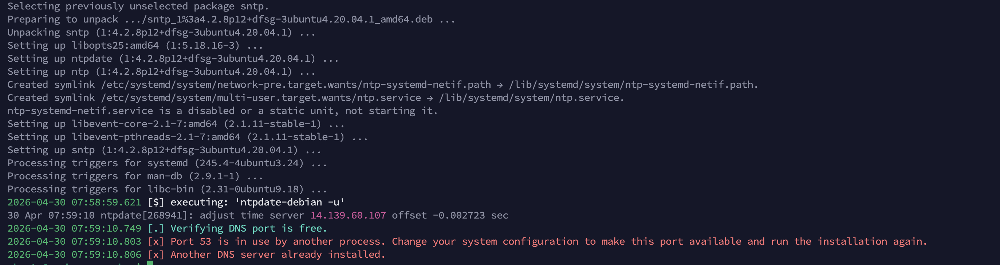 -->

**Root Cause:**
Redis Enterprise installs its own internal DNS server (`bind`) on port 53. On Ubuntu 18.04+, `systemd-resolved` is running by default and occupies port 53, blocking the Redis Enterprise installer.

**Resolution:**

Reference: https://redis.io/docs/latest/operate/rs/installing-upgrading/install/prepare-install/port-availability/#os-conflicts-with-port-53

Followed the official Redis port availability guide — freed port 53 by disabling the `systemd-resolved` DNS stub listener without fully removing `systemd-resolved`:

```bash
# Step 1 — Edit /etc/systemd/resolved.conf and add DNSStubListener=no as the last line
sudo vi /etc/systemd/resolved.conf
# Add at end of file:
# DNSStubListener=no

# Step 2 — Rename the current /etc/resolv.conf
sudo mv /etc/resolv.conf /etc/resolv.conf.orig

# Step 3 — Create a symbolic link for /etc/resolv.conf
sudo ln -s /run/systemd/resolve/resolv.conf /etc/resolv.conf

# Step 4 — Restart the DNS service
sudo service systemd-resolved restart

# Step 5 — Re-run the Redis Enterprise installer
sudo ./install.sh -y
```

**Status:** ✅ Resolved — set `DNSStubListener=no` in `systemd-resolved`, recreated `/etc/resolv.conf` symlink, restarted DNS service, then re-ran `install.sh -y` successfully.

<!-- Add screenshot of resolved state / successful install here -->
<!-- Example: 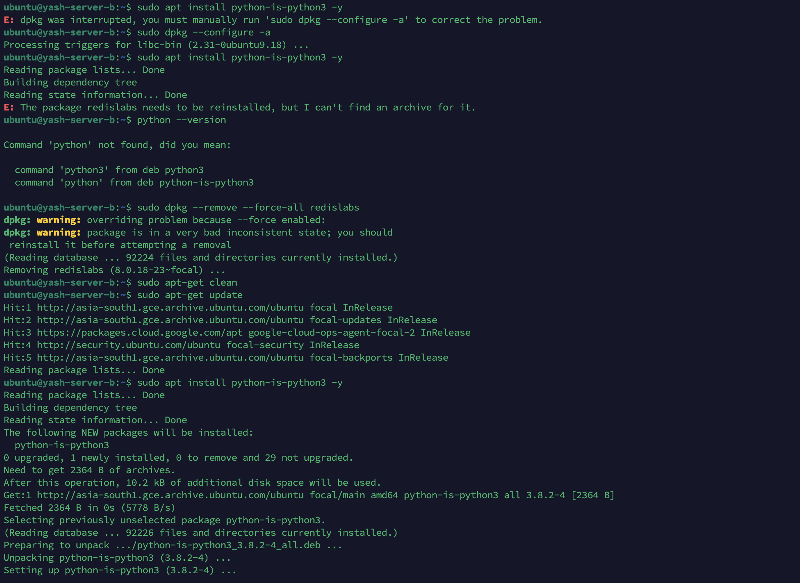 -->

---

### Issue 3 — `python: command not found` During Redis Enterprise Installation

**Command run:**
```bash
sudo ./install.sh -y
```

**Error:**
```
./install.sh: line 466: python: command not found
```

**Screenshot:**
<!-- Add screenshot of the error here -->
<!-- Example: 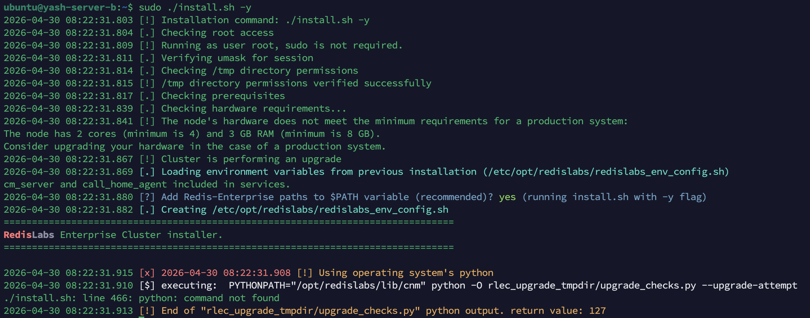 -->

**Root Cause:**
Ubuntu 20.04+ (Focal) ships with `python3` only. The `python` binary (Python 2 / unversioned) is not available by default, and the Redis Enterprise `install.sh` script calls `python` directly at line 466.

**Resolution — Full Steps Followed:**

**Step 1 — Update APT and install `python-is-python3`:**
```bash
sudo apt update
sudo apt install python-is-python3 -y
```

**Step 2 — Hit `dpkg` interrupted error:**
```
E: dpkg was interrupted, you must manually run 'sudo dpkg --configure -a' to correct the problem.
```

Fix:
```bash
sudo dpkg --configure -a
```

**Step 3 — Retry `python-is-python3` install — hit another error:**
```
E: The package redislabs needs to be reinstalled, but I can't find an archive for it.
```

Fix — force-remove the broken `redislabs` package, clean APT cache, and update:
```bash
sudo dpkg --remove --force-all redislabs
sudo apt-get clean
sudo apt-get update
```

**Step 4 — Re-install `python-is-python3` and re-run the Redis Enterprise installer:**
```bash
sudo apt install python-is-python3 -y

# Verify python symlink
python --version
# Output: Python 3.x.x ✅

# Re-run Redis Enterprise installer
sudo ./install.sh -y
```

> **Root Cause Summary (APT Lock & Half-Installed Package):**
> Interrupting the installer due to the Port 53 and Python errors left the `redislabs` package in a **`reinstreq` (reinstall required) state**, which locked the APT package manager and prevented any further `apt install` operations. Using `sudo dpkg --remove --force-all redislabs` cleared the broken package metadata, allowing system dependencies (`python-is-python3`) to be installed and the Redis Enterprise installation to be restarted from a clean state.

**Status:** ✅ Resolved — force-removed broken `redislabs` package, cleaned APT cache, installed `python-is-python3`, then re-ran `install.sh -y` successfully.

<!-- Add screenshot of resolved install here -->
<!-- Example:  -->

---

### Issue 4 — Unable to Connect to Redis OSS During Replica Of Setup

**Error observed:**
```
Unable to connect to redis://<SERVER_A_IP>:6380
```

**Diagnosis — TCP connectivity test from Server B:**
```bash
nc -zv <SERVER_A_IP> 6380
# Output: port 6380 (tcp) failed: Connection refused
```

**Root Cause:**
UFW (Uncomplicated Firewall) was active on **Server A** and had no rule permitting inbound TCP connections on port 6380. Since Redis was configured to listen on a non-default port (6380), the firewall was silently blocking all incoming connections from Server B to the Redis OSS instance.

**Resolution — Full Steps on Server A:**

**Step 1 — Open port 6380 in UFW:**
```bash
sudo ufw allow 6380/tcp
# Output: Rules updated ✅

# Verify the rule was added
sudo ufw status
```

**Step 2 — Update `redis.conf` to bind on all interfaces:**

Redis was configured to bind only to `127.0.0.1` (loopback), preventing any external connections even after the firewall was opened.

```bash
sudo nano /etc/redis/redis.conf
```

Changes made:

```conf
# Before (loopback only — blocks external connections)
bind 127.0.0.1 -::1

# After (bind on all interfaces — allows remote connections)
bind 0.0.0.0

# Also disable protected mode to allow unauthenticated external access
protected-mode no
```

```bash
# Restart Redis to apply changes
sudo systemctl restart redis-server
```

**Step 3 — Verify connectivity from Server B:**
```bash
nc -zv <SERVER_A_IP> 6380
# Output: Connection to <SERVER_A_IP> 6380 port [tcp/*] succeeded! ✅
```

> ✅ Resolved — UFW rule opened port 6380, `bind 0.0.0.0` allowed external connections, and `protected-mode no` permitted unauthenticated access. Replica Of connection from Redis Enterprise (Server B) to Redis OSS (Server A) succeeded.

---

## Image References

All images are stored in the [`images/`](images/) folder.

| Image File | Description |
|------------|-------------|
| `images/redis-oss-conf.png` | redis.conf configuration snapshot |
| `images/memtier-baseline.png` | memtier-benchmark baseline output (empty DB) |
| `images/memtier-load.png` | memtier-benchmark data load output (100K keys) |
| `images/memtier-postload.png` | memtier-benchmark post-load output (100K keys DB) |
| `images/re-install-port53-error.png` | Redis Enterprise install — Port 53 in use error |
| `images/re-install-python-error.png` | Redis Enterprise install — python command not found error |
| `images/re-install-success.png` | Redis Enterprise install — successful completion |
| `images/re-create-cluster.png` | Redis Enterprise web UI — Create Cluster landing page |
| `images/re-set-credentials.png` | Redis Enterprise web UI — Set admin credentials screen |
| `images/re-cluster-config.png` | Redis Enterprise web UI — Cluster FQDN configuration screen |
| `images/re-cluster-dashboard.png` | Redis Enterprise web UI — Cluster dashboard after login |
| `images/re-db-config.png` | Redis Enterprise DB configuration snapshot |
| `images/re-replication-status.png` | Replication status on Redis Enterprise |
